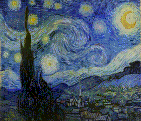

# pixel-sort
Display the sorting process of different sorting algorithms on image pixels

## Featrues
Six kinds of sorting algorithm: 
- bubble sort
- selection sort
- insertion sort
- quick sort
- merge sort
- heap sort


## Installation
Dependencies: numpy, opencv-python, matplotlib
``` shell
git clone https://github.com/Matoi647/pixel-sort.git
cd ./pixel-sort
pip install -r requirements.txt
```

## Usage
``` shell
pyhton pixel-sort.py [image path] [arguments]
```

some arguments:
| Parameter         | Type    | Default | Description                                                  |
|-------------------|---------|---------|--------------------------------------------------------------|
| `--resolution`      | int     | 240      | Resample image to given resolution (image height)           |
| `--algorithm`     | str     | bubble  | Sorting algorithm to apply. Choices: bubble, selection, insertion, quick, merge, heap |
| `--interval`      | int     | 10      | Time interval between two frames (in milliseconds).           |
| `--step`          | int     | 1       | Number of pixels swapped per frame.                           |
| `--sort_by_col`   | boolean | False   | Sort by column instead of row.                                |
| `--split_rgb`     | boolean | False   | Split image into RGB channels and sort each channel separately. |
| `--reverse`       | boolean | False   | Sort pixel values in descending order.                        |

## Examples
```
python pixel-sort.py "StarryNight.jpg" --algorithm bubble --sort_by_col --step 10 --reverse
```

